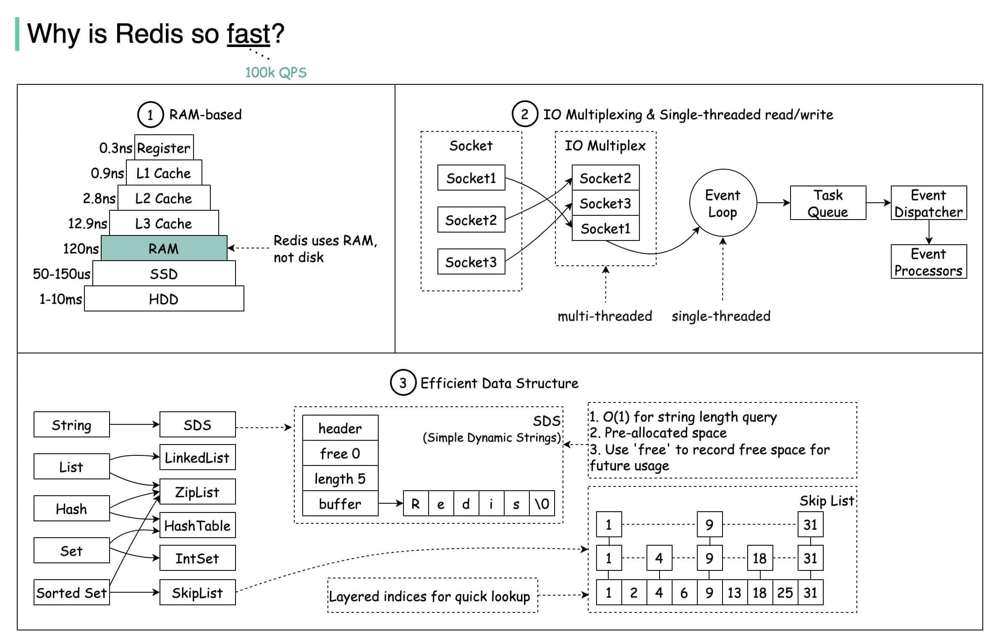

# Cache

### Redis

!!! info "why so fast"



!!! info "supported applications"

[分布式锁](Cache.md#redis)

[限流](ratelimit.md#redis)

消息队列

延时队列

分布式session


##### Cache 策略

|                    | Write                                     | Read                                                            |                              |
| ------------------ | ----------------------------------------- | --------------------------------------------------------------- | ---------------------------- |
| Cache Aside        | update DB； delete cache item；           | read from cache; missed then read from db ; put data into cache | 考虑强一致场景，写操作需加锁 |
| Read/Write Through |                                           |                                                                 |                              |
| Write Behind       | update to Cache, after while, flush to DB |                                                                 |                              |

##### Cache Issue

- 雪崩
大量KEY 失效后，大流量直接访问数据库

```
对KEY设置随机过期时间
限流熔断
数据库读写分离
```
- 击穿
热点KEY 失效后，大流量直接访问数据库

```
热点KEY 过期时间设置长
互斥锁，Cache KEY 访问失败后，需要获取锁，才能访问数据库
```
- 穿透
不存在的KEY，大流量直接访问数据库

```
布隆过滤器, 先判断是否KEY存在，不存在就直接返回NULL
```

##### Cache 淘汰算法

FIFO First In First Out

LFU leastly frequently used

```
优点：高频使用的数据，可以较长的保存不被淘汰。
缺点：无法缓存某一时间点的热点数据。
```
LRU leastly recently used

```
LRU 算法使用页面置换算法，会首先淘汰最长时间未被使用的数据。
优点：热点数据，可以较长的保存不被淘汰
缺点：当某一时间节点产生了大量仅访问了一次的数据，热点数据会被淘汰
```
LRU - K
```
LRU-K 算法中需要维护两个队列：历史队列和缓存队列
历史队列保存着每次访问的页面，当页面访问次数达到了 k 次，该页面出栈，并保存至缓存队列；
若尚未达到 k 次则继续保存，直至历史队列也满了，那就根据一定的缓存策略（FIFO、LRU、LFU）进行淘汰；
缓存队列则是保存已经访问 k 次的页面，当该队列满了之后，则淘汰最后一个页面.

LRU-K 算法的核心思想就是将访问一次就能淘汰其余缓存的 “1” 提升为 “K”。
优点：避免了仅访问 1 次就能淘汰其余缓存的 “缓存污染” 问题，提高了缓存命中率。
缺点：多维护了一个历史队列，消耗内存较高
```
LRU - 2Q

#####  Redis 淘汰

Redis并不会立马删除过期的数据。Redis 采用「惰性删除」+「定期删除」的组合策略，对过期数据进行清理。

**惰性删除**
当有客户端的请求查询该 key 时，服务端会检查下 key 是否过期，如果过期，则删除该 key

**定期删除**
会将设置了过期时间的 key 放入到一个独立的字典中，在「定期删除」策略中，会定时遍历这个字典，删除过期的数据

实际内存超出 maxmemory 时，Redis 提供了如下几种策略

noeviction

volatile-lru: 尝试淘汰设置了过期时间的 key，最少使用的 key 优先被淘汰

volatile-ttl: key 的剩余寿命 ttl 的值，ttl 越小越优先被淘汰

volatile-random:

allkeys-lru: 没有设置过期时间的 key 也会被淘汰

allkeys-random: 随机的 key.


##### 持久化

snapshotting, RDB

append-only, AOF

RDB & AOF


##### 集群

- Master Slave

- Sentinel

主从复制基础上加入了哨兵节点，实现了自动故障转移,会监控主节点和从节点的运行状态。当主节点发生故障时，哨兵节点会自动从从节点中选举出一个新的主节点，并通知其他从节点和客户端，实现故障转移。

- Cluster

Cluster模式下，Redis将所有的键值对数据分散在多个节点上。每个节点负责一部分数据，称为槽位。通过对数据的分片，Cluster模式可以突破单节点的内存限制，实现更大规模的数据存储。Redis Cluster将数据分为16384个槽位，每个节点负责管理一部分槽位。当客户端向Redis Cluster发送请求时，Cluster会根据键的哈希值将请求路由到相应的节点。具体来说，Redis Cluster使用CRC16算法计算键的哈希值，然后对16384取模，得到槽位编号

##### [基本数据类型](https://javaguide.cn/database/redis/redis-data-structures-01.html)

| String                    | List       | Set           | Hash         | Zset              |
| ------------------------- | ---------- | ------------- | ------------ | ----------------- |
| SDS simple dynamic string | Linkedlist | Dict, ZipList | Dict, IntSet | ZipList, SkipList |

SkipList

跳跃表以链表+多层索引的结构， 效率和平衡树媲美 —— 查找、删除、添加等操作都可以在对数期望时间下完成， 并且比起平衡树来说， 跳跃表的实现要简单直观得多

ZipList
