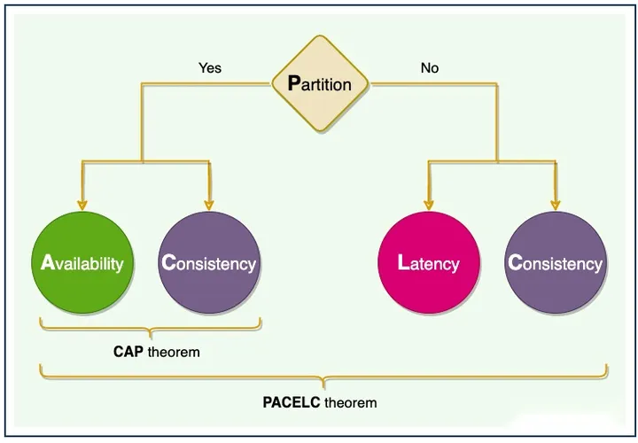

# 分布式一致性

### CAP

C：Consistency，一致性，所有数据变动都是同步的。

A：Availability，可用性，即在可以接受的时间范围内正确地响应用户请求。

P：Partition tolerance，分区容错性，即某节点或网络分区故障时，系统仍能够提供满足一致性和可用性的服务。

### BASE

BA：Basically Available，基本可用。

S：Soft State，软状态，状态可以有一段时间不同步。

E：Eventually Consistent，最终一致，最终数据是一致的就可以了，而不是时时保持强一致。

### PACELC

PACELC 定理指出，在复制数据的系统中：
如果存在分区（“P”），分布式系统可以在可用性和一致性（即“A”和“C”）之间进行权衡；
else（‘E’），当系统在没有分区的情况下正常运行时，系统可以在延迟（‘L’）和一致性（‘C’）之间进行权衡。