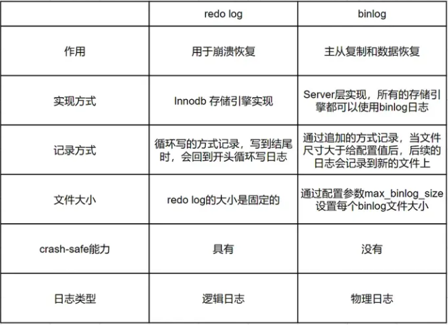

# DB 

### MySQL

!!! info "Lock"

    | Category    | Desc                                                  |
    | ----------- | ----------------------------------------------------- |
    | table-level | Low Cost; Most Effectivive;  Highest lock conflicting |
    | row-level   | high cost; very slow; Lowest lock conflicting         |
    | page-level  |                                                       |

!!! info "存储引擎"

MySQL 存储引擎采用的是 插件式架构 ，支持多种存储引擎，可以为不同的数据库表设置不同的存储引擎以适应不同场景的需要。存储引擎是基于表的，而不是数据库。

MyISAM 只有表级锁(table-level locking)，而 InnoDB 支持行级锁(row-level locking)和表级锁,默认为行级锁。

MyISAM 不提供事务支持，InnoDB 提供事务支持

MyISAM 不支持外键，而 InnoDB 支持外键， 实际业务中，不建议使用外键，影响性能

MyISAM 不提供**MVCC**，InnoDB 提供**MVCC**

虽然 MyISAM 引擎和 InnoDB 引擎都是使用 B+Tree 作为索引结构，但是两者的实现方式不太一样。

MyISAM 不支持数据库异常崩溃后的安全恢复，而 InnoDB 支持

InnoDB 的性能比 MyISAM 更强大

!!! info "索引"

[B+ tree](BTree.md) 

聚簇索引（聚集索引）：索引结构和数据一起存放的索引，InnoDB 中的主键索引就属于聚簇索引。
非聚簇索引（非聚集索引）：索引结构和数据分开存放的索引，二级索引(辅助索引)就属于非聚簇索引。
MySQL 的 MyISAM 引擎，不管主键还是非主键，使用的都是非聚簇索引。

!!! info "回滚的原理"

回滚原理是基于**undo log**实现的。 当一个事务开始时，MySQL会创建一个新的undo日志记录。 当事务中的每一个操作被执行时，都会在[**undo log**](#undo-log)中添加一条相反的操作。 如果事务失败，MySQL就会按照**undo log**中的记录，逆序执行这些操作，把数据恢复到事务开始之前的状态。


!!! info "同步"

Master 同步 Slave, 读写分离 ， 故障切换， 高可用HA， 架构扩展

- 同步方式
    - 一主多从
    - 多主一从 
    - 双主复制
    - 级联复制(半同步)
        - Slave 通过 slave 同步，不直接与Master 同步


- 同步原理
    -  Master 启动 Log Dump Thread, read **bin log** and lock it, then release once complete reading
    -  Slave 启动 IO Thread , read **bin log** on Master and save it to **relay-log**
    -  Slave 启动 SQL Thread, read **relay log** and execute

  -    

!!! info "日志"
##### redo log

MySQL的[**WAL机制**](WAL.md)。因为MySQL进行更新操作，为了能够快速响应，所以采用了异步写回磁盘的技术，写入内存后就返回。但是这样，会存在crash后内存数据丢失的隐患，而redo log具备crash safe的能力。

```
redo log 是重做日志。
它记录了数据页上的改动。
它指事务中修改了的数据，将会备份存储。
发生数据库服务器宕机、或者脏页未写入磁盘，可以通过redo log恢复。
它是Innodb存储引擎独有的

redo log每次更新操作完成后，就一定会写入的，如果写入失败，说明此次操作失败，事务也不可能提交。
```  


##### bin log 日志

bin log是归档日志，属于MySQL Server层的日志。可以实现主从复制和数据恢复两个作用。
当需要恢复数据时，可以取出某个时间范围内的bin log进行重放恢复。
但是bin log不可以做crash safe，因为crash之前，bin log可能没有写入完全MySQL就挂了。所以需要配合redo log才可以进行crash safe。

**binlog日志有三种格式**

Statement：基于SQL语句的复制((statement-based replication,SBR)) 每一条会修改数据的sql都会记录在binlog中
Row:基于行的复制。(row-based replication,RBR) 不记录sql语句上下文相关信息，仅保存哪条记录被修改
Mixed:混合模式复制。(mixed-based replication,MBR) Statement与Row的结合

**binlog 刷盘机制**





##### undo log 

用于记录数据被修改前的信息。
它跟redo log重做日志所记录的相反，重做日志记录数据被修改后的信息。undo log主要记录的是数据的逻辑变化，为了在发生错误时回滚之前的操作，需要将之前的操作都记录下来，这样发生错误时才可以回滚。