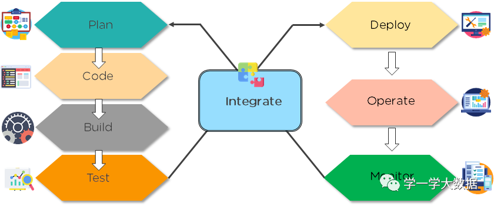
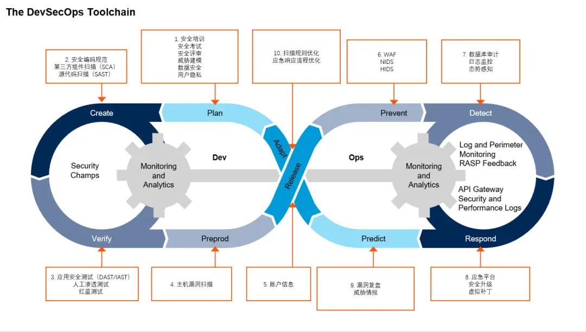

# DevOps

DevOps is the combination of cultural philosophies, practices, and tools that increases an organization’s ability to deliver applications and services at high velocity: evolving and improving products at a faster pace than organizations using traditional software development and infrastructure management processes. This speed enables organizations to better serve their customers and compete more effectively in the market. 

DevOps emphasizes better collaboration and efficiencies so teams can innovate faster and deliver higher value to businesses and customers.




```
敏捷专注于迭代，增量，小型和快速发布软件以及客户反馈,解决了客户与开发人员之间的差距和冲突
DevOps解决了开发人员与IT运营之间的空白和冲突
```

### Challenges

- 自动化测试
- 微服务集成测试
- 配置管理
- 监控和报警

### Continuous Integration & Delivery

```
持续集成 (CI) 是一个开发过程，每天多次将代码集成到共享存储库中。借助自动化测试，CI 帮助允许团队及早识别错误、轻松定位问题，提高了软件质量并缩短了交付时间
```

```
持续交付 (CD) 与持续集成相集成，以向用户顺利交付产品。它旨在确保代码可以安全地部署到生产环境中。在 CD 环境中，无论是大型系统还是复杂的应用程序，新版本都可以立即按需执行，功能齐全，而且只需要极少的人工干预
```

```
持续部署进一步推进了持续交付，其中代码被构建、部署到生产环境、还可以自动测试并在发生错误时快速回滚。具体来说，每个更改都会直接部署到生产环境中，无需额外的人工干预
```

### DevSecOps

在DevSecOps中，安全性被嵌入到软件开发过程的每个阶段中，包括规划、编码、组装、测试、发布等所有创作阶段。

软件组成分析**SCA**的重要性以及开源组件漏洞所带来的风险

SAST（Static Application Security Testing，静态应用程序安全测试）对应用程序源代码执行直接的白盒分析。分析是在代码的静态视图上运行的，这意味着代码在审查时没有运行

DAST（Dynamic Application Security Testing，动态应用程序安全测试）对应用程序进行黑盒分析，这意味着它们不能访问代码或实现细节。DAST只检查系统对潜在漏洞测试的请求和响应。换言之，DAST是外部的漏洞扫描程序。

IAST（Interactive Application Security Testing，交互式应用程序安全测试）结合了SAST和DAST的优点。IAST可以像SAST一样看到源代码，也可以像DAST一样看到应用程序运行时的执行流。

[OpenRSAP](https://rasp.baidu.com/doc/)


