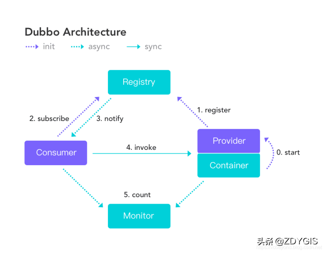
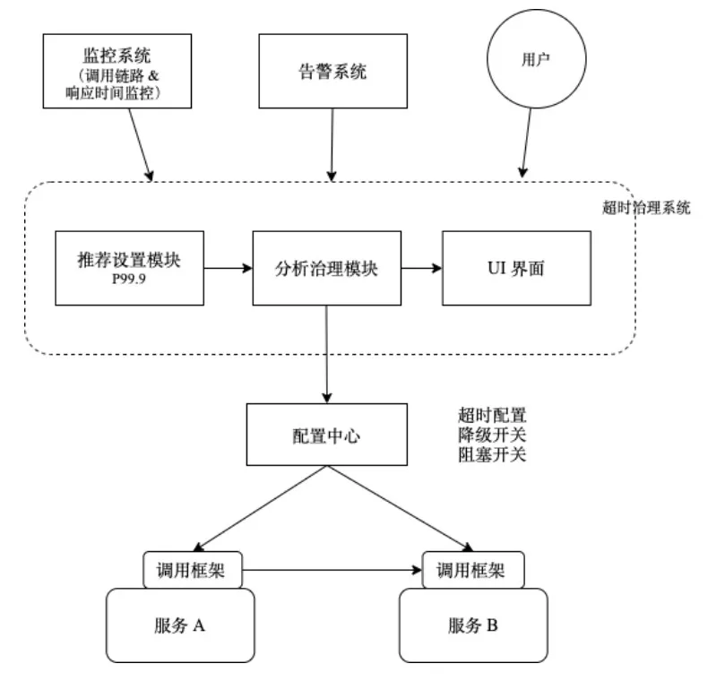

# MicroService

### Framework

!!! info inline "Dubbo"

[Dubbo](Dubbo.md)

    
    


---

!!! info "spring cloud"

    服务注册发现    动态路由      负载均衡      配置管理      消息总线        熔断器        分布式链路追踪       大数据操作


### Key

#####  "微服务的跨库查询"

    微服务拆分后，底层数据库也会拆分。

    - 可以通过数据冗余，但是会带来**数据延迟，数据不一致**的潜在风险，共享的数据放到 ODS 数据层；

    - 也可以通过建立领域层来提供Aggregator来解决对应问题；

##### "业务域拆分数据库"

    微服务在代码层进行拆分，数据库实例还是共享模式；

##### "微服务变更"

    微服务变更期间对相关调用方和被调用方的影响

##### "微服务的领域编排"

    领域组合微服务实际上是一类比较特殊的微服务，即这类微服务本身完成多个微服务API接口的组合编排，完成分布式事务管理和协调，完成组合业务规则的实现和处理等。
    比如: 
    ```
    对于订单提交这个操作，实际需要调用后端订单中心，预算中心，库存中心多个微服务接口
    ```

##### "微服务网关和API网关"

    API网关一般具备独立的服务注册接入，负载均衡和路由能力,统一接入、安全防护、协议适配、流量管控、长短链接支持、[服务容错能力](./ServiceTolernce.md)

    微服务网关是通过和服务注册中心的集成来实现服务注册发现，负载均衡和路由

##### [超时治理](https://www.infoq.cn/article/eyrslar53l6hjm5yjgyx)

超时时间的设置，和熔断、限流⼀样，是异常状况下系统的⼀种⾃我保护机制，熔断、限流都已经从业务解耦⾄框架层，如利⽤API ⽹关可以统⼀处理微服务之间调⽤的熔断、限流。超时时间的设置，也可以借助运维体系内其他框架，实现解耦并⾃动设定，如下图。



包含三个模块：推荐设置模块，分析治理模块、UI 界⾯。并对外部依赖监控系统（Prometheus 等）、告警系统、配置中⼼（Consul、etcd）、及统⼀的⽹络调⽤框架（Http）。该系统还可以嵌⼊监控系统内 作为其内部功能来实现，或在响应时间监控的基础性进⾏改造。

